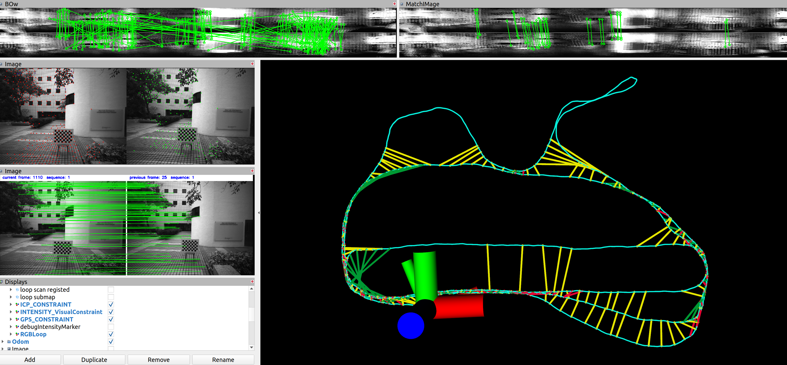
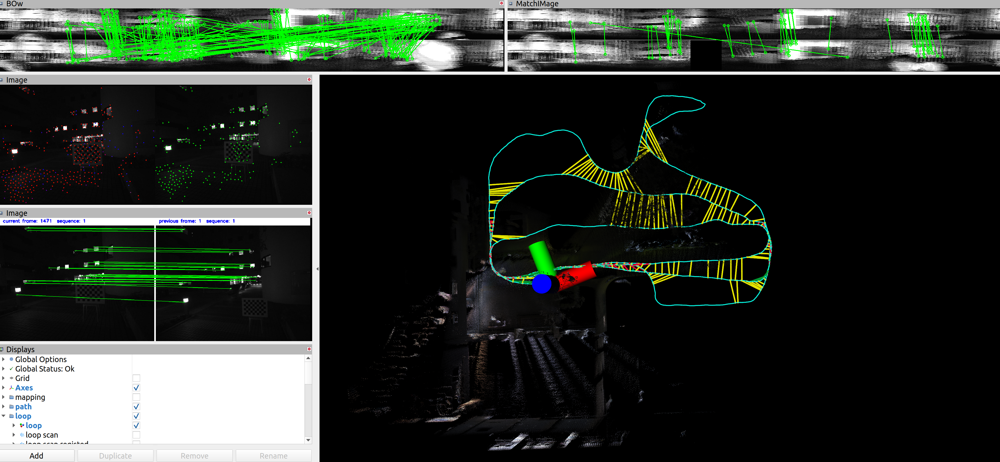
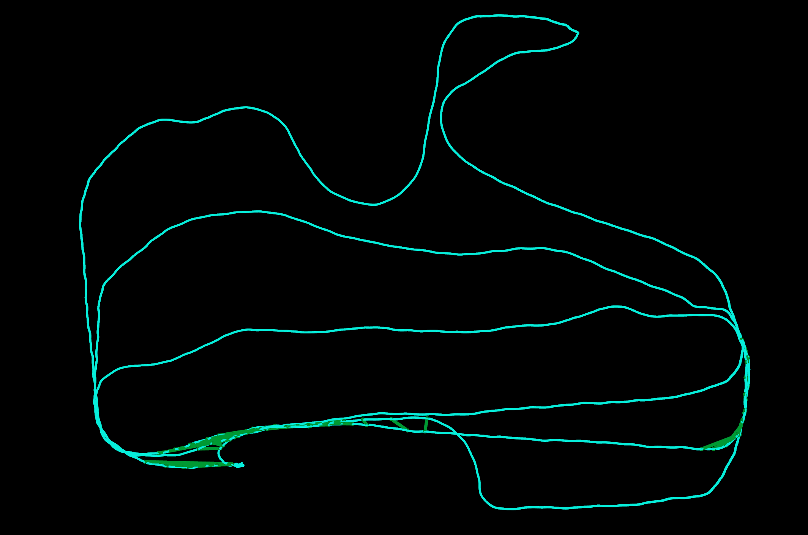

# LIO-SAM-6AXIS-VLOOP
LIO-SAM-6AXIS with visual loop detection

- green line segments represent for RGB images loop detection by DBOW3

### garden day

## garden night

## canteen day

.png)

.png)

